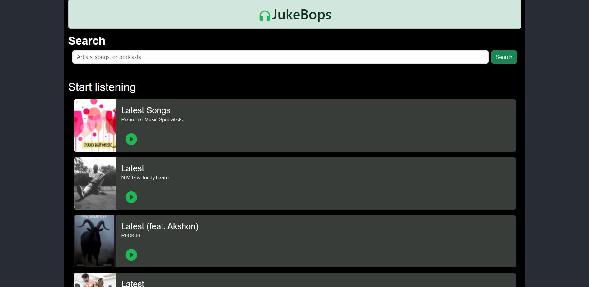

# Jukeboks Music Application

Jukeboks is a full-stack music application built using MERN (MongoDB, Express.js, React.js, Node.js) stacks. It allows users to listen to their latest and favorite songs, search for songs, and play their chosen tracks with a simple click. The application utilizes Material UI for design components and CSS for additional styling.



## Table of Contents

- [Features](#features)
- [Demo](#demo)
- [Prerequisites](#prerequisites)
- [Installation](#installation)
- [Running the Application](#running-the-application)
- [Usage](#usage)
- [Technology Stack](#technology-stack)

## Features

Jukeboks is a full-stack music application that provides the following features:

- User authentication with bcrypt for password hashing and storage.
- Playback of latest and favorite songs.
- Search functionality to find songs by title, artist, or album.
- Integration with iTunes API using Axios for fetching songs.
- Responsive design using Material UI and CSS.

## Demo

You can view a live demo of the application [here](https://music-app-alpha-inky.vercel.app/).

## Prerequisites

Before running the application, ensure you have the following installed:

- Node.js
- npm (Node Package Manager)
- MongoDB (for backend data storage)

## Installation

1. Clone the repository:
   ```bash
   https://github.com/Etika8445/Music-App.git

2. Install dependencies for both frontend and backend:
   ```bash
   cd frontend
   cd musicapp
   npm install

   cd backend
   npm install

## Running the Application

To start the application locally, follow these steps:

### Set up environment variables:

1. Create a `.env` file in the backend directory and add necessary environment variables (e.g., database connection string, API keys).
   
2. Start the frontend server:
   ```bash
   cd musicapp
   npm start
3. Start the backend server:
   ```bash
   cd backend
   npm start
4. Open your browser and navigate to `http://localhost:3000` to use the Jukeboks application.


## Usage

1. Register or login with your credentials.
2. Explore and play your favorite songs.
3. Use the search feature to find specific songs.

## Technology Stack

### Frontend:

- React.js
- Material UI
- Axios

### Backend:

- Node.js
- Express.js
- MongoDB (for user authentication and data storage)

### Password Security:

- bcrypt (for hashing and storing passwords securely)


